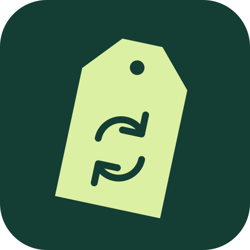
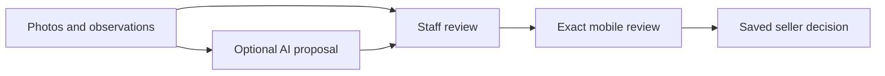

<p align="center">
  
</p>

<p align="center">
  
</p>

<p align="center">
  <strong>Give great things a second life. Give your store a better system.</strong><br>
  Open-source software for second-hand stores selling on consignment.<br>
  Built in the open. Designed for people and their AI agents.
</p>

<p align="center">
  <a href="https://github.com/Komisio/komisio/actions/workflows/test-db.yml"></a>
  <a href="LICENSE"></a>
  <a href="ROADMAP.md"></a>
</p>

<p align="center">
  <a href="https://komisio-staging.vercel.app">Explore the preview</a> ·
  <a href="#run-it-locally">Run it locally</a> ·
  <a href="ROADMAP.md">Roadmap</a> ·
  <a href="CONTRIBUTING.md">Build with us</a>
</p>

## Your stock is unique. Your software should keep up.

A jacket comes in. Someone else owns it. Your store sells it. You keep a
commission. They get their share. Every item has a story — and someone waiting
to be paid.

Komisio is being built around that reality: the handover, the people, the sale
and the settlement. Sweden first, with Nordic ambitions. A focused system for
the shops giving things another life.

**Less chasing spreadsheets. More running your store.** That's the goal.

## Small team. Big ambition. Open source.

**Your store, your team.** Create a store, invite colleagues and give each person
the right access. The foundation includes owner, admin, staff and read-only
roles, store switching and a web interface in Swedish and English.

**AI should do the legwork. You keep control.** Our architectural direction is
one shared engine for the interface, extensions and AI agents. Agents should
prepare work for approval, with permissions and business rules enforced by the
system. Photo-based reception, optional AI suggestions and local MCP reads are
available as a pilot. Durable agent approvals and financial operations are still
ahead of us. [See how AI fits](docs/HOW-AI-FITS.md).

**Open means you can look under the hood.** Inspect the code, run the current
platform locally and help shape what comes next. AGPL-3.0-or-later, with a
documented extension exception. No AI subscription is needed to run the preview.

**Focused on second-hand. Connected to the rest.** A day close becomes a
balanced voucher under the store's own account map, downloadable as SIE 4 or
sent straight to Fortnox as one voucher per day; the same data can feed
systems such as Accounted. Komisio invents no accounts and no postings and is
not a bookkeeping application. [Accounting export](docs/ACCOUNTING-EXPORT.md)
· [Fortnox connection](docs/FORTNOX-CONNECTION.md).

**Sell through your POS. Keep the seller informed.** Accepted items go out to
Zettle with stock and product photos, and completed receipts come back as
sales with automatic seller credit; unmatched receipts are held for a person.
The live pilot runs against a real merchant. [Zettle live retrieval](docs/ZETTLE-LIVE-PULL.md).

**Pay the people who trust you.** Seller balances, payout requests, approval
and a settlement batch that pays every seller who is due, with a numbered
statement per seller. [Settlement](docs/SETTLEMENT.md) · [Economy overview](docs/ECONOMY-OVERVIEW.md).

**Agents that prepare, people who decide.** Reception proposals, price
evidence from the store's own sales, an automatic markdown agent under the
store's policy, a weekly brief written from the same numbers, and a local MCP
server with scoped tools for reads and staged proposals. [How AI fits](docs/HOW-AI-FITS.md)
· [MCP tools](mcp/README.md).

## From handover to payout


The whole chain runs today: **register a seller, receive a bag or a single
garment, inspect and accept it with frozen terms, sell it through the POS or
by hand, close the day, export or send the voucher, and pay the seller**.
Sellers can hand in on their own with a QR handover and follow their money in
a seller portal. Every financial fact is append-only, every correction is a
new row, and every agent action is staged for a person to approve. See
[versioned seller agreements](docs/SELLER-AGREEMENTS.md),
[self drop-off](docs/SELF-DROPOFF.md), the
[functional roadmap](docs/FUNCTIONAL-ROADMAP.md) and the
[open domain questions](docs/open-questions.md).

### Start with a jacket. Keep the decision human.

The new single-garment reception path starts with **photos and observations**.
A configured AI adapter can propose a description and a selling price backed by
supplied evidence. Staff reviews the result, then the seller sees the exact
photos, price and terms on their phone and approves or declines.



The web interface and local AI tools use the same engine. Photo access is private,
reviews are versioned, and a changed or revoked review cannot authorize a new
decision. No camera hardware or market-price feed is connected yet. The hosted
AI adapter stays off until explicitly configured; manual preparation works now.
See the [pilot walkthrough](docs/RECEPTION-PILOT.md).

## What can I use today?

**This is a working platform preview, not a finished store system.**
The [hosted preview](https://komisio-staging.vercel.app) is a test environment;
use test data rather than real consignor or financial records.

| Available in the current platform                                             | Still being built or planned                                                           |
| ----------------------------------------------------------------------------- | -------------------------------------------------------------------------------------- |
| Registration, e-mail confirmation, login, password recovery, optional MFA     | Production environment and the pilot gates ([checklist](docs/ONBOARDING-AND-PLANS.md)) |
| Stores, four access roles, invitations, access log, Swedish and English       | Payout rails (Swish, Stripe) beyond manual "paid with reference"                       |
| Seller registration, bag and single-garment reception, labels, self drop-off  | Space booking and booking fees                                                         |
| Versioned agreements, inspection drafts, acceptance with frozen terms         | Shopify and web shop channels                                                          |
| Sales, returns, store-owned purchases, one currency per store                 | Hosted agent OAuth and a hosted agent runtime                                          |
| Zettle: product export with stock and photos, live receipt retrieval          | Wall-camera pairing and automated capture                                              |
| Day close, account map, SIE 4 export, Fortnox voucher sending, reconciliation | Print transport for label printers                                                     |
| Seller ledger, payouts, settlement batch, statements, seller portal           | Cross-store price comparison (opt-in)                                                  |
| Economy overview, weekly and monthly brief, markdown agent, price evidence    | Similar-photo detection with a model ([design](docs/DUPLICATE-CHECK.md))               |
| Staged operations with risk levels, MCP server with scoped tools              | Multi-tenant provider connections with per-store credentials                           |
| Trial and plans with Stripe, automation actor, sellers list, duplicate checks | Automatic Fortnox sending, retention and erasure                                       |
| Item search by title, category and stage; agent reads of items and receipts   | Agent seller lookup and item price proposals                                           |

The hosted preview is a staging environment for the pilot store and the
people building Komisio. See [pilot gates](docs/PILOT-GATES.md) for what
stands between the preview and an external pilot, and the
[functional roadmap](docs/FUNCTIONAL-ROADMAP.md) for the phases.

### Free to run. Simple to rent.

Self-hosted Komisio is free under the project licence. The intended hosted
offer is one plan: a full month free, then **199 SEK per store and month**.
This is the direction, not an available subscription; see the
[onboarding and plans design](docs/ONBOARDING-AND-PLANS.md) for how a store
would start, activate and pay.

## Help build the system you wish existed

You don't need to write code to make Komisio better.

- **Run a second-hand store?** [Share a workflow](https://github.com/Komisio/komisio/issues/new): how you receive items, agree commissions or prepare payouts. Use fictional examples and leave out personal data.
- **Care about great software?** Try the platform and tell us where it feels confusing. Clear bug reports, accessibility feedback and translations all help.
- **Want to build?** Start with the [contribution guide](CONTRIBUTING.md) and [roadmap](ROADMAP.md). For larger changes, open an issue first so we can agree on the scope.

If this is the kind of software you want to see in the world, **give the repo a
star and follow along.** We're early enough for your input to matter.

## Run it locally

Requires Node.js (24 LTS recommended), npm, Docker and Supabase CLI 2.117.0.
The initial container download can take a few minutes.

```bash
git clone https://github.com/Komisio/komisio.git
cd komisio
npm ci
npm run db:start
npm run db:migrate
node scripts/configure-local.mjs
npm run dev
```

Open <http://127.0.0.1:3000>. Register and confirm your email in the local test
inbox at <http://127.0.0.1:54324>, using the same browser.

The helper writes public local client settings to ignored `.env.local`;
it needs no application service-role key. Do not run it over existing hosted
settings. Apply changes with `npm run db:migrate`; do not reset an existing database.

This runs the app locally with Supabase containers. A packaged application
Docker deployment is not yet available. See [self-hosting](docs/SELF-HOSTING.md)
and [hosted staging setup](docs/HOSTED-STAGING.md) for configuration and limits.

## For the curious and the builders

Next.js · React · TypeScript · Supabase (PostgreSQL, Auth and row-level security).
One SQL engine holds every rule: the web interface, the MCP tools and the
extensions call the same functions, and pgTAP proves them. Money is integer
minor units, facts are append-only, and every non-human write is staged.

| Start here                                       | What you'll find                                             |
| ------------------------------------------------ | ------------------------------------------------------------ |
| [Architecture](ARCHITECTURE.md)                  | Target boundaries for the core, UI, AI and extensions        |
| [Functional roadmap](docs/FUNCTIONAL-ROADMAP.md) | Phases P1 to P6, what is delivered and what is next          |
| [Staged operations](docs/STAGED-OPERATIONS.md)   | How agent and extension writes wait for a person             |
| [How AI fits](docs/HOW-AI-FITS.md)               | A jacket's journey, file responsibilities and current limits |
| [Decisions](DECISIONS.md)                        | What we've chosen and why                                    |
| [Roadmap](ROADMAP.md)                            | Milestones and acceptance scenarios                          |
| [Extensions](docs/EXTENSIONS.md)                 | The proposed integration contract                            |
| [Agent instructions](CLAUDE.md)                  | How AI-assisted contributions are governed                   |
| [Domain knowledge](skills/)                      | Working notes for humans and agents                          |
| [Security](SECURITY.md)                          | Reporting vulnerabilities and access principles              |

Application routes live in `app/`, shared UI in `components/`, identity and
permissions in `lib/platform/`, database migrations and tests in `supabase/`,
and translations in `messages/`. Earlier schema explorations live in
`experiments/`; they are not the active product model.

Checks: `npm run lint`, `npm run typecheck`, `npm test`, `npm run build`,
`npm run test:db`, `npm run test:concurrency` and `npm run test:e2e`.
Browser tests use synthetic accounts and must target only a local test environment.

## License

[AGPL-3.0-or-later](LICENSE), with an [exception for extensions](NOTICE) using
only the documented extension API. Contributions use the [DCO](DCO), with
signed-off commits and no CLA. Code, comments and documentation are in English;
the application speaks Swedish and English.

---

**Good things deserve another life. Good software deserves to be open.**
