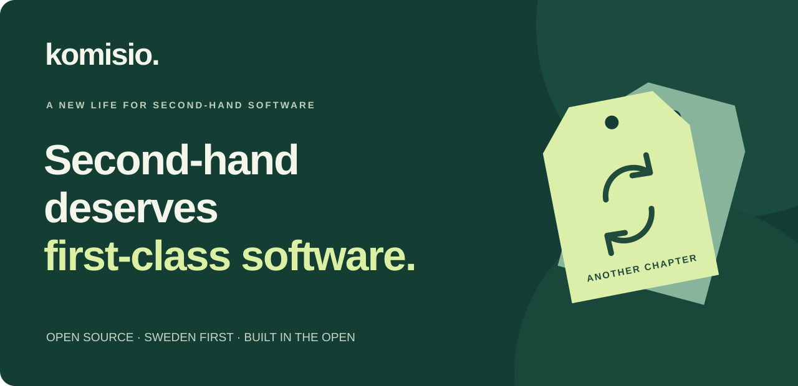
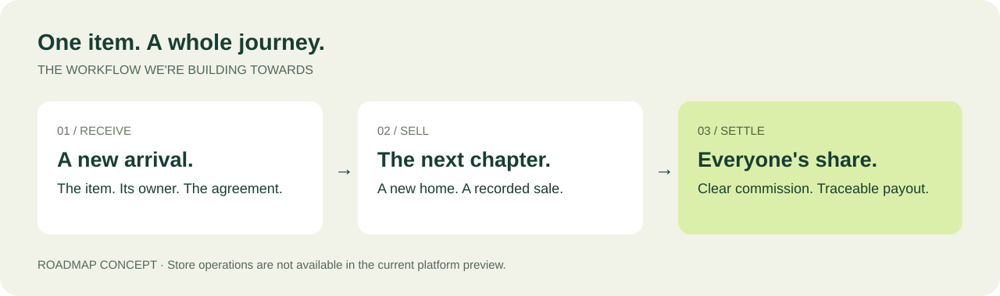
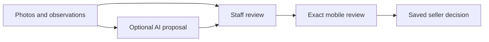

<p align="center">
  
</p>

<p align="center">
  <strong>Give great things a second life. Give your store a better system.</strong><br>
  Open-source software for second-hand stores selling on consignment.<br>
  Built in the open. Designed for people and their AI agents.
</p>

<p align="center">
  <a href="https://github.com/Komisio/komisio/actions/workflows/test-db.yml"></a>
  <a href="LICENSE"></a>
  <a href="ROADMAP.md"></a>
</p>

<p align="center">
  <a href="https://komisio-staging.vercel.app">Explore the preview</a> ·
  <a href="#run-it-locally">Run it locally</a> ·
  <a href="ROADMAP.md">Roadmap</a> ·
  <a href="CONTRIBUTING.md">Build with us</a>
</p>

## Your stock is unique. Your software should keep up.

A jacket comes in. Someone else owns it. Your store sells it. You keep a
commission. They get their share. Every item has a story — and someone waiting
to be paid.

Komisio is being built around that reality: the handover, the people, the sale
and the settlement. Sweden first, with Nordic ambitions. A focused system for
the shops giving things another life.

**Less chasing spreadsheets. More running your store.** That's the goal.

## Small team. Big ambition. Open source.

**Your store, your team.** Create a store, invite colleagues and give each person
the right access. The foundation includes owner, admin, staff and read-only
roles, store switching and a web interface in Swedish and English.

**AI should do the legwork. You keep control.** Our architectural direction is
one shared engine for the interface, extensions and AI agents. Agents should
prepare work for approval, with permissions and business rules enforced by the
system. Photo-based reception, optional AI suggestions and local MCP reads are
available as a pilot. Durable agent approvals and financial operations are still
ahead of us. [See how AI fits](docs/HOW-AI-FITS.md).

**Open means you can look under the hood.** Inspect the code, run the current
platform locally and help shape what comes next. AGPL-3.0-or-later, with a
documented extension exception. No AI subscription is needed to run the preview.

**Focused on second-hand. Connected to the rest.** Komisio is intended to
produce bookkeeping data for systems such as Accounted and Fortnox.
Accounting integrations are planned; Komisio is not a bookkeeping application.

**Sell through your POS. Keep the seller informed.** The local Zettle simulator
now exercises accepted items going out and completed sales coming back with
automatic seller credit. Live connection and inventory synchronization are still
pending. [Test the integration](docs/ZETTLE-FIXTURE-PULL.md).

## From handover to payout



The first store operation is deliberately small: **register a seller, receive
a bag and print its label**. Staff reviews the contents later. This gated pilot
is now enabled in the hosted staging preview and can also run locally after
migration and activation. Staff can use [versioned seller agreements
and external approval evidence](docs/SELLER-AGREEMENTS.md) and save
[descriptive item drafts during inspection](docs/SAVED-INSPECTION.md). Space booking, seller
signatures, sales and payouts follow as separate workflows. See the
[implementation sequence](docs/SELLER-FLOW-IMPLEMENTATION.md) and
[open domain questions](docs/open-questions.md).

### Start with a jacket. Keep the decision human.

The new single-garment reception path starts with **photos and observations**.
A configured AI adapter can propose a description and a selling price backed by
supplied evidence. Staff reviews the result, then the seller sees the exact
photos, price and terms on their phone and approves or declines.



The web interface and local AI tools use the same engine. Photo access is private,
reviews are versioned, and a changed or revoked review cannot authorize a new
decision. No camera hardware or market-price feed is connected yet. The hosted
AI adapter stays off until explicitly configured; manual preparation works now.
See the [pilot walkthrough](docs/RECEPTION-PILOT.md).

## What can I use today?

**This is a working platform preview, not a finished store system.**
The [hosted preview](https://komisio-staging.vercel.app) is a test environment;
use test data rather than real consignor or financial records.

| Available in the current platform | Still being built or planned |
| --- | --- |
| Registration, email confirmation, login and password recovery | Inspection completion and saleable inventory |
| Store creation and switching between your stores | Sales, returns and commission |
| Profiles and optional authenticator-app MFA | Settlements and payouts |
| Membership administration and four access roles | Accounting and other integration extensions |
| Email-bound invitation links and optional pilot email delivery | Hosted agent OAuth and durable agent approval workflows |
| Access log and responsive Swedish/English interface | Billing and commercial hosted plans |
| Seller registration, bag receiving and printable labels | Seller portal and digital signatures |
| Versioned store agreements and staff-recorded approval evidence | Space booking and booking fees |
| Resumable descriptive item drafts with protected revision history | Commercial acceptance and POS publication |
| Private reception photos and exact mobile approve/decline | Wall-camera pairing and automated capture |
| Optional sourced AI suggestions and local MCP reads/previews | Live model quality evaluation and market-price integrations |

Hosted onboarding and invitation edge cases are still being validated during
the pilot. See [platform status](docs/PLATFORM-STATUS.md) for details and
[the roadmap](ROADMAP.md) for acceptance gates.

### Free core. Optional convenience.

The intended model is a **free tier** and a **199 SEK/month hosted tier** focused
on managed integrations and automation. This is the product direction, not an
available subscription: billing, exact plan limits and launch terms are not
implemented or finalized. The source is available now under the project license.

## Help build the system you wish existed

You don't need to write code to make Komisio better.

- **Run a second-hand store?** [Share a workflow](https://github.com/Komisio/komisio/issues/new): how you receive items, agree commissions or prepare payouts. Use fictional examples and leave out personal data.
- **Care about great software?** Try the platform and tell us where it feels confusing. Clear bug reports, accessibility feedback and translations all help.
- **Want to build?** Start with the [contribution guide](CONTRIBUTING.md) and [roadmap](ROADMAP.md). For larger changes, open an issue first so we can agree on the scope.

If this is the kind of software you want to see in the world, **give the repo a
star and follow along.** We're early enough for your input to matter.

## Run it locally

Requires Node.js (24 LTS recommended), npm, Docker and Supabase CLI 2.117.0.
The initial container download can take a few minutes.

```bash
git clone https://github.com/Komisio/komisio.git
cd komisio
npm ci
npm run db:start
npm run db:migrate
node scripts/configure-local.mjs
npm run dev
```

Open <http://127.0.0.1:3000>. Register and confirm your email in the local test
inbox at <http://127.0.0.1:54324>, using the same browser.

The helper writes public local client settings to ignored `.env.local`;
it needs no application service-role key. Do not run it over existing hosted
settings. Apply changes with `npm run db:migrate`; do not reset an existing database.

This runs the app locally with Supabase containers. A packaged application
Docker deployment is not yet available. See [self-hosting](docs/SELF-HOSTING.md)
and [hosted staging setup](docs/HOSTED-STAGING.md) for configuration and limits.

## For the curious and the builders

Next.js · React · TypeScript · Supabase (PostgreSQL, Auth and row-level security).
The active schema covers identity, receiving and versioned preparation/review
evidence. Domain workflows come before a financial data model.

| Start here | What you'll find |
| --- | --- |
| [Architecture](ARCHITECTURE.md) | Target boundaries for the core, UI, AI and extensions |
| [How AI fits](docs/HOW-AI-FITS.md) | A jacket's journey, file responsibilities and current limits |
| [Decisions](DECISIONS.md) | What we've chosen and why |
| [Roadmap](ROADMAP.md) | Milestones and acceptance scenarios |
| [Extensions](docs/EXTENSIONS.md) | The proposed integration contract |
| [Agent instructions](CLAUDE.md) | How AI-assisted contributions are governed |
| [Domain knowledge](skills/) | Working notes for humans and agents |
| [Security](SECURITY.md) | Reporting vulnerabilities and access principles |

Application routes live in `app/`, shared UI in `components/`, identity and
permissions in `lib/platform/`, database migrations and tests in `supabase/`,
and translations in `messages/`. Earlier schema explorations live in
`experiments/`; they are not the active product model.

Checks: `npm run lint`, `npm run typecheck`, `npm test`, `npm run build`,
`npm run test:db`, `npm run test:concurrency` and `npm run test:e2e`.
Browser tests use synthetic accounts and must target only a local test environment.

## License

[AGPL-3.0-or-later](LICENSE), with an [exception for extensions](NOTICE) using
only the documented extension API. Contributions use the [DCO](DCO), with
signed-off commits and no CLA. Code, comments and documentation are in English;
the application speaks Swedish and English.

---

**Good things deserve another life. Good software deserves to be open.**
